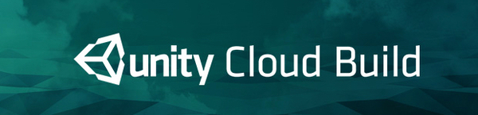

#

## About
OcuViz is a platform for the visualisation of data in a virtual 3D space to allow users to conceptualise large numbers more accurately and naturally. Leveraging the power of VR we are able to create awe-inspiring and immersive scenes for users to experience. As well as, allowing users to create their own scenes through either modular CSV files which are interpreted into 3D scenes or a simplified editor without requiring the user having to be a graphics experts.

# Getting Started

## Installation 

Ensure you meet the minimum hardware requirements and have installed the necessary software. Setup your hardware. Then simply download and extract the zip file to your computer and run the OcuViz.exe.

## Prerequistes

### Hardware requirements:

+ **VR:** &nbsp;&nbsp;&nbsp;&nbsp;&nbsp;&nbsp;&nbsp;&nbsp;&nbsp;&nbsp;&nbsp;&nbsp;&nbsp;&nbsp;&nbsp; Oculus Rift DK2 / CV1
+ **GPU:** &nbsp;&nbsp;&nbsp;&nbsp;&nbsp;&nbsp;&nbsp;&nbsp;&nbsp;&nbsp;&nbsp;&nbsp;&nbsp; Nvidia GTX 970 or AMD R9 290 or better 
+ **CPU:** &nbsp;&nbsp;&nbsp;&nbsp;&nbsp;&nbsp;&nbsp;&nbsp;&nbsp;&nbsp;&nbsp;&nbsp;&nbsp; Intel i5 4590 or greater
+ **RAM:** &nbsp;&nbsp;&nbsp;&nbsp;&nbsp;&nbsp;&nbsp;&nbsp;&nbsp;&nbsp;&nbsp;&nbsp; 8GB DDR3 or more
+ **Video:** &nbsp;&nbsp;&nbsp;&nbsp;&nbsp;&nbsp;&nbsp;&nbsp;&nbsp;&nbsp;&nbsp; HDMI 1.3 port
+ **USB:** &nbsp;&nbsp;&nbsp;&nbsp;&nbsp;&nbsp;&nbsp;&nbsp;&nbsp;&nbsp;&nbsp;&nbsp;&nbsp;&nbsp; 2x USB 3.0 ports + 2x USB 2.0 ports
+ **Controllers:** &nbsp;&nbsp; Leap motion, Xbox controller

### Software requirements:

+ **OS:** &nbsp;&nbsp;&nbsp;&nbsp;&nbsp;&nbsp;&nbsp;&nbsp;&nbsp;&nbsp;&nbsp;&nbsp;&nbsp;&nbsp;&nbsp;&nbsp; Windows 7 SP1 (64 bit) or newer
+ **VR:** &nbsp;&nbsp;&nbsp;&nbsp;&nbsp;&nbsp;&nbsp;&nbsp;&nbsp;&nbsp;&nbsp;&nbsp;&nbsp;&nbsp;&nbsp;&nbsp; [Rift Runtime 1.3](https://www3.oculus.com/en-us/setup/)
+ **Tracking:** &nbsp;&nbsp;&nbsp;&nbsp;&nbsp; [Leap Motion](https://www.leapmotion.com/setup)

### Setup:

1. Ensure Leap Motion is [mounted on your VR headset](https://developer.leapmotion.com/vr-setup).
2. Connect your Oculus Rift Headset, head tracker, Xbox controller.
3. Run Rift Runtime and Leap Motion Control Panel.
4. Run OcuViz.exe

### Troubleshooting:

```
Oculus Rift is not displaying an image while running OcuViz.exe
```
Check the Oculus Rift Headset for an orange light. If this is the case, restart the Rift Runtime software. If after restarting the Rift still has an orange light, simply turn the headset off and on again. You should now see a blue light.

```
Why is Leap Motion's tracking is poor?
```
Firstly open Leap Motion controll panel and head to the `Troubleshooting` tab. It should show all green on the right hand side. It will show whether your Leap Motion controller is properly powered, clean sensor and what the tracking conditions are like. Please note if Leap Motion is connect via USB   2.0 instead of 3.0 there will be a degredation in preformance.

# Team


## Members:

+ Gerome Schutte
+ Nonotokozo Hlatshwayo
+ Vukile Langa
+ Hugo Meiring

# Technologies
<p align="center"></p>

<p align="center"></p>

<p align="center"></p>

<p align="center"></p>

<p align="center"></p>
